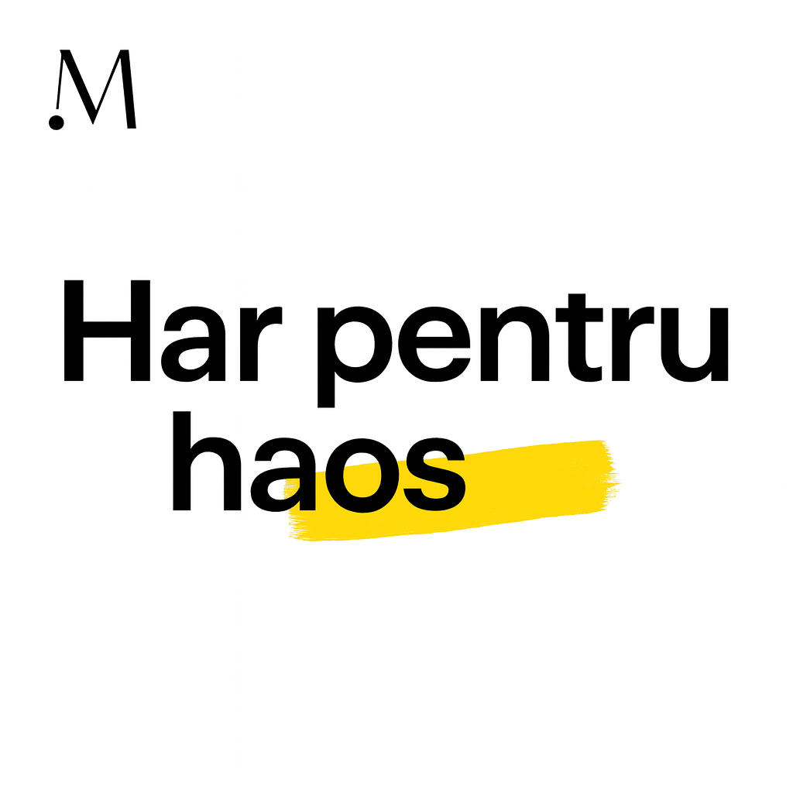

# MOMCO UNU-UNU — Har pentru haos

<p align="center">
  
  <br/>
  <em>Un strop de har în mijlocul haosului.</em>
  
</p>

Devoțional de 31 de zile pentru mame. Câte o zi, câte un pas — cu har, nu cu presiune.

## Vezi live 🔗

[unu-unu-ro.github.io/momco](https://unu-unu-ro.github.io/momco/)

Sugestie: Deschide pe telefon pentru cea mai bună experiență.

## Ce include ✨

- 31 de zile în `continut.json`: titlu, rugăciune, verset (+ opțional o secțiune suplimentară).
- Interfață mobilă curată, navigare prin chips 1–31, săgeți Înapoi/Înainte, tap pe antet pentru Ziua 1.
- Ține minte automat ultima zi (localStorage) și suportă link direct la o zi (`?zi=12`).
- Partajare nativă (buton portocaliu „Trimite cuiva mesajul de azi”) cu fallback la clipboard.
- Card opțional „Secțiune” când în JSON există câmpul `sectiunea`.
- Motto fix în footer, favicon și branding momco.
- Preview social (Open Graph + Twitter Card) cu `thumb.png`.
- Accesibilitate: focus vizibil, aria-live pe conținut, navigare cu săgeți stânga/dreapta.

Notă: Butonul „Ziua următoare” a fost eliminat; navigarea se face din chips sau cu săgețile.

## Rulare locală ▶️

Aplicația încarcă `continut.json` prin `fetch`, deci servește fișierele prin HTTP, nu direct din filesystem.

Opțiuni rapide:

- Extensia „Live Server” din VS Code, sau
- Un server simplu (ex.: Python):

```powershell
python -m http.server 5500
# apoi deschide http://localhost:5500
```

## Structura conținutului (`continut.json`) 📦

Fiecare element din listă reprezintă o zi:

```json
{
  "ziua": 1,
  "titlul": "Titlul zilei",
  "rugaciunea": "O rugăciune scurtă...",
  "versetul": "Referință sau text de verset...",
  "sectiunea": "(opțional) O notă sau o secțiune suplimentară"
}
```

Câmpurile sunt tolerate și cu denumiri alternative (`titlu`/`titlul`, `verset`/`versetul`, `rugaciune`/`rugaciunea`), dar recomandăm forma din exemplu.

## Social preview 📣

- `thumb.png` este folosit pentru Open Graph și Twitter Card (summary_large_image).
- După publicare, este ideal să folosești URL absolut către imagine (nu cale relativă) pentru o detectare 100% de către crawleri.

## Personalizare rapidă 🎨

- Titlu/subtitlu: în `index.html` (antet) și motto-ul din footer.
- Imagine socială: înlocuiește `thumb.png` și, după deploy, pune URL absolut în meta taguri.
- Culori/stil: `styles.css` (variabilele din `:root`, clasele `.primary.share-cta`, etc.).

Mulțumim! Ne rugăm ca aceste 31 de zile să aducă pace, speranță și suflu nou inimii și casei tale.
